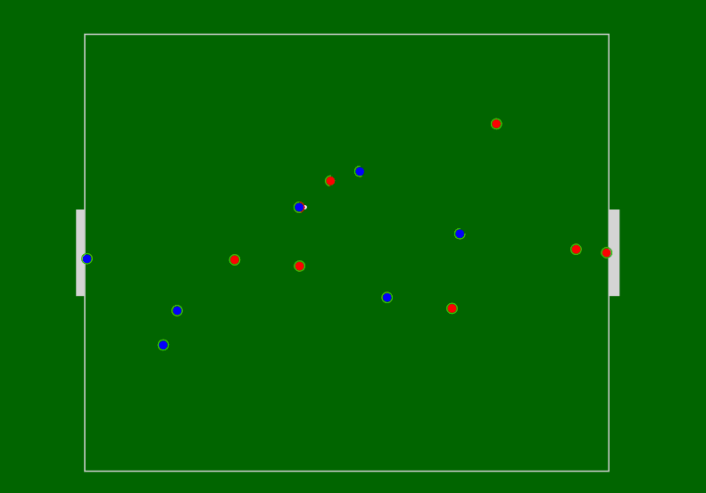

# **Implementing an Elementary RoboCup** using **Symbolic AI** and **Logic Programming** with **Prolog**

<center>This project is focused on the development of an elementary RoboCup program using knowledge of Symbolic AI, HTML, JavaScript & <strong>Prolog</strong>. The objective of this Prolog-based RoboCup is to produce a virtual model of a soccer game where players interact with the ball and agents are assigned distinct roles aligned with behaviors.</center>

## **Group Members**

- Syeda Azmathunnisa Raza 6738060921
- Yanathep Prasitsomsakul 6738067321
- Porrapat Lomsomboon 6738137621
- Phukla Jeerawattana 6738159421
- Warit Suntrarom 6738233121

## **Usage Guide**

1. To simulate a game, open `swipl` and ensure that the working directory is the same directory as all of the source files.
2. Consult `'robocup.pl'`.
3. Query the _runSimulation/0_ predicate and a game will be generated and a game log will be created in the gamelogs directory. This game log can then be uploaded to our visualization program.

```prolog
?- consult('robocup.pl').
?- runSimulation.
```

To edit the parameters of the simulation, one can open ‘robocup.pl’ and directly modify the parameters inside the runSimulation predicate. Comments can be found next to each option describing what they do.

### Format

A JSON file with the format name `game_XXXXXX.json` is generated inside a
separate directory containing the game logs, when the function is run.

### Visualization



The representation of the simulation output is through a 2D canvas inside an [HTML webpage](https://agareverie.github.io/robocup-symbolic/visualization/). Since the game is generated in a JSON file, a visualizer using JavaScript can load the file directly. Additionally, customization settings and camera controls are provided.

**Controls**:

- **WASD** - Camera Movement
- **Left/Right Click** - Drag Camera
- **QE/Scroll Wheel** - Zoom In/Out
- **Middle Click** - Follow Target
- **B** - Follow Ball
- **F** - Follow Nearby Target
- **Tab** - Cycle Through Agents
- **Space** - Stop Following
- **P** - Toggle Pause
- **V** - Toggle On-screen Text

## **Other Documentation**

- [Engine Explanation](docs/engine.md)
